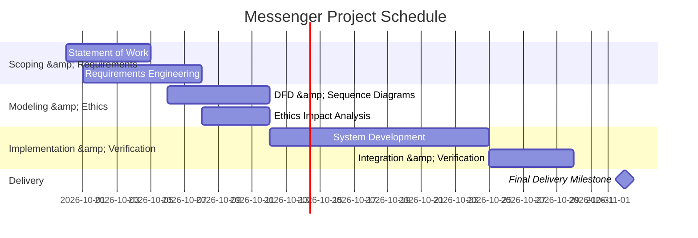

# Statement of Work: Messenger System

**Project:** CPS 490 Capstone I — Messenger  
**Author:** Lucas Swearingen
**Faculty Mentor:** Nick Stiffler  
**Target Submission Path:** `docs/statement-of-work.md`  
**Assignment Due Date:** October 12, 2026  
**Final System Delivery Deadline:** November 2, 2026

## 1. Project Purpose and Objectives

*   **Problem Statement:** This Messenger project provides a clean, bounded, and defensible text communication platform that establishes secure user identity, guarantees persistent message delivery across direct and group channels, and enforces  data privacy.

*   **Primary Objectives:**
    *   **OBJ-01 (Secure Identity &amp; Authentication):** Provide a user account management subsystem ensuring unique identity registration and credential protection via strong passwords.
    *   **OBJ-02 (Direct Private Messaging):** Enable authenticated users to initiate, transmit, and view private 1-on-1 text messaging threads with designated recipients.
    *   **OBJ-03 (Group-Based Messaging Channels):** Support multi-user channels where registered users can create groups, manage member rosters, and broadcast text messages to all channel participants.
    *   **OBJ-04 (Message Persistence &amp; History Retrieval):** Ensure all direct and group text messages persist across application/server restarts and can be retrieved chronologically by authorized participants.
    *   **OBJ-05 (Defensible Engineering Artifacts):** Deliver a complete software package accompanied by reviewable repository documentation (`docs/`) adhering strictly to the CPS 490 standards.

## 2. Stakeholders

| Stakeholder | Project Role | Concern | Authority &amp; Decision Limits |
| :--- | :--- | :--- | :--- |
| **Course Instructor / Client** | Project Sponsor &amp; Review Authority | Verifies that project commitments, documentation, and executable deliverables satisfy capstone requirements and grading rubrics. | **Final Acceptance Authority:** Approves scope boundaries, reviews deliverables, and validates completion against criteria.
| **End Users** | Registered Users Operating the Application | Require intuitive, reliable 1-on-1 and group text communication with minimal latency and high uptime. | **User Feedback:** Explains operational needs; cannot approve scope changes or extra work. | 
| **Software Engineer (Student)** | Lead Architect &amp; Developer | Responsible for system design, implementation, testing, and repository maintenance. | **Technical Implementation Authority:** Proposes scope trade-offs, designs system architecture, and executes verification. | 

## 3. Scope Boundary

### In-Scope Functionality

*   Feature 1: **User Registration &amp; Authentication:** Account creation, unique user ID assignment, password strength requirement, and session login/logout verification.
*   Feature 2: **Private Direct Messaging:** Asynchronous and real-time 1-on-1 text message transmission between registered users.
*   Feature 3: **Group Messaging Channels:** Creation of group channels, member invitation/removal, and multi-user message distribution.
*   Feature 4: **Persistent Message History:** Storing direct and group messages in a database with chronological query capabilities.

### Explicitly Out-of-Scope Functionality

*   Feature 1: **Real-Time Voice &amp; Video Streaming:** Audio/video calls and voice channels are excluded.
*   Feature 2: **Screen Sharing &amp; Presentation Mode:** Screen capture streaming and live desktop broadcasting are excluded.
*   Feature 3: **Multi-Tier Server Hierarchies:** Multi-role permission trees and multi-channel server structures are excluded (bounded to direct chats and group channels).

## 4. Deliverables

*   **DEL-01 (Statement of Work):** `docs/statement-of-work.md` 
    - Bounded project agreement defining purpose, scope, deliverables, Gantt schedule, and acceptance criteria.
*   **DEL-02 (Requirements Engineering Document):** `docs/requirements.md`
    - 
*   **DEL-03 (System Diagrams &amp; Analysis):** `docs/analysis.md` `docs/diagrams/data-flow.puml` `docs/diagrams/sequence.puml` 
    - 
*   **DEL-04 (Ethics Reflection):** `docs/ethics-reflection.md`
    - 
*   **DEL-05 (Executable Messenger Software System):** Complete, verified executable product
    - Executable application and clean setup/run instructions.

## 5. Assumptions, Constraints, and Dependencies

*   **Assumptions:** 
    * **ASM-01 (Max Group Membership Capacity):** Initial channel capacity is assumed to be capped at 50 users per group.  
    * **ASM-02 (Message Payload Size Limit):** Individual text messages are assumed to be capped at 2,000 UTF-8 characters.  
*   **Constraints:**
    * **CON-01 (Final Delivery Deadline):** The complete, verified Messenger system must be delivered no later than **November 2, 2026**.
    * **CON-02 (Assignment Artifacts Deadline):** Submission of repository documentation (`IA-02` through `IA-05`) must be pushed to GitHub no later than **October 12, 2026**.
    * **CON-03 (Submission Platform):** The submission record is strictly defined by commits pushed to the assigned GitHub course repository before the deadline.
    * **CON-04 (Diagram Format Standard):** Diagrams must be written as readable text-based source code under `docs/diagrams/`.
*   **Dependencies:** [External decisions, platforms, or tools required for execution] 

## 6. Milestones and Schedule

### Project Milestones

| Milestone ID | Description | Target Completion Date |
| :--- | :--- | :--- |
| **MS-01** | Statement of Work &amp; Requirements Sign-off | [Date] |
| **MS-02** | Diagrams &amp; Behavioral Modeling Complete | [Date] |
| **MS-03** | Core Direct &amp; Group Messaging Verification | [Date] |
| **MS-04** | Integration &amp; Final Readiness Review | [Target date prior to Nov 2] [16, 19] |
| **MS-05** | Final Product Delivery Deadline | **November 2, 2026** [16, 19] |

### Project Schedule (Gantt Chart)

## 7. Acceptance Criteria

* **AC-01:** System deliverables satisfy all documented functional requirements via observable test evidence[7][12].
* **AC-02:** All artifacts are committed, correctly formatted, and pushed to required paths in GitHub[1][13].