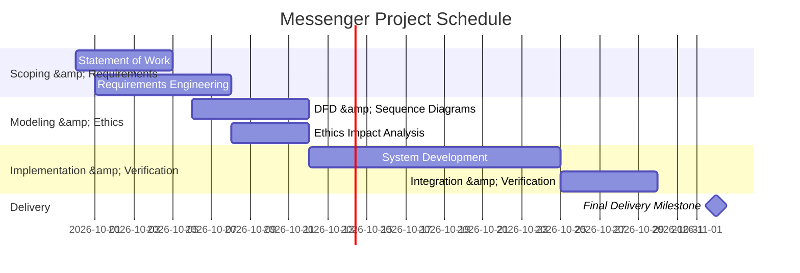

# Statement of Work: Messenger System

## 1. Project Purpose and Objectives

*   **Problem Statement:** [Describe the communication problem Messenger solves without assuming Discord-level scale] [11, 12].
*   **Primary Objectives:**
    *   **OBJ-01:** [Objective 1: High-level outcome, e.g., enable secure direct private messaging between registered users] [12, 13].
    *   **OBJ-02:** [Objective 2: High-level outcome, e.g., support multi-user group messaging channels] [12, 13].

## 2. Stakeholders

| Stakeholder / Group | Role / Relationship to Project |
| :--- | :--- |
| **Client / Course Instructor** | Defines overarching project goals, reviews deliverables, and determines acceptance [7, 12]. |
| **End Users (Registered Users)** | Primary operators who send/receive direct and group messages [12]. |
| **Software Engineer (Student)** | Responsible for scoping, requirements engineering, modeling, and system delivery [11, 14]. |

## 3. Scope Boundary

### In-Scope Functionality

*   [Feature 1: e.g., User registration and credential authentication] [12, 15].
*   [Feature 2: e.g., Direct 1-on-1 private messaging] [12, 15].
*   [Feature 3: e.g., Creation and management of group messaging channels] [12, 15].

### Explicitly Out-of-Scope Functionality

*   [Feature 1: e.g., Voice and video streaming capabilities] [15, 16].
*   [Feature 2: e.g., Bot integrations or third-party plugin marketplaces] [15, 16].

## 4. Deliverables

*   **DEL-01 (Statement of Work):** `docs/statement-of-work.md` [1].
*   **DEL-02 (Requirements Engineering Document):** `docs/requirements.md` [2].
*   **DEL-03 (System Diagrams &amp; Analysis):** `docs/analysis.md` and PlantUML diagrams under `docs/diagrams/` [3].
*   **DEL-04 (Ethics Reflection):** `docs/ethics-reflection.md` [4].
*   **DEL-05 (Messenger Software System):** Complete, verified executable product [15, 16].

## 5. Assumptions, Constraints, and Dependencies

*   **Assumptions:** [Conditions currently believed true that may require future stakeholder confirmation] [17].
*   **Constraints:**
    *   **CON-01 (Final Delivery Deadline):** The completed product must be ready no later than **November 2, 2026** [16, 17].
    *   **CON-02 (Submission Platform):** Submission is defined exclusively by the committed repository state pushed to GitHub [1, 18].
*   **Dependencies:** [External decisions, platforms, or tools required for execution] [17].

## 6. Milestones and Schedule

### Project Milestones

| Milestone ID | Description | Target Completion Date |
| :--- | :--- | :--- |
| **MS-01** | Statement of Work &amp; Requirements Sign-off | [Date] |
| **MS-02** | Diagrams &amp; Behavioral Modeling Complete | [Date] |
| **MS-03** | Core Direct &amp; Group Messaging Verification | [Date] |
| **MS-04** | Integration &amp; Final Readiness Review | [Target date prior to Nov 2] [16, 19] |
| **MS-05** | Final Product Delivery Deadline | **November 2, 2026** [16, 19] |

### Project Schedule (Gantt Chart)

## 7. Acceptance Criteria

* **AC-01:** System deliverables satisfy all documented functional requirements via observable test evidence[7][12].
* **AC-02:** All artifacts are committed, correctly formatted, and pushed to required paths in GitHub[1][13].